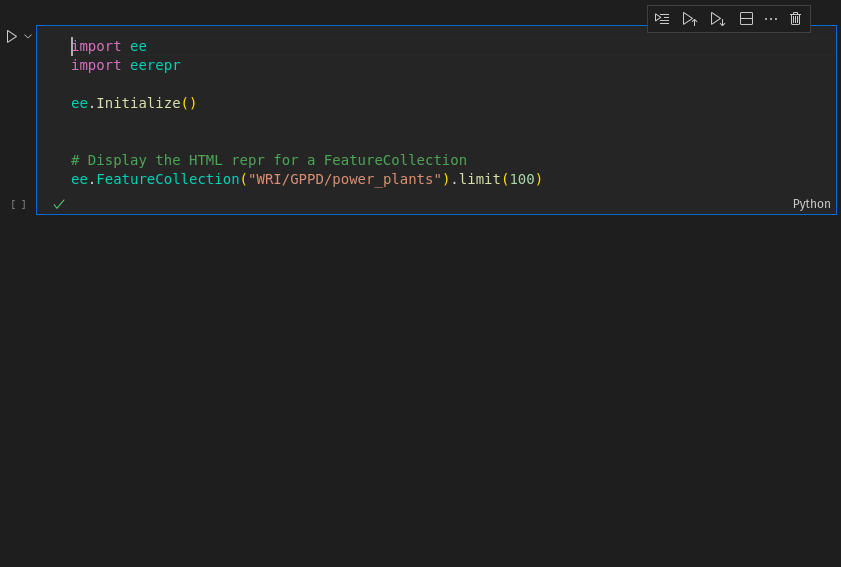

# eerepr

[](https://developers.google.com/earth-engine/tutorials/community/intro-to-python-api)
[](https://badge.fury.io/py/eerepr)
[](https://anaconda.org/conda-forge/eerepr)
[](https://nbviewer.org/github/aazuspan/eerepr/blob/main/docs/notebooks/demo.ipynb)
[](https://colab.research.google.com/github/aazuspan/eerepr/blob/main/docs/notebooks/demo.ipynb)

Add interactive Code Editor-style HTML reprs to Earth Engine objects in a Jupyter environment.



## Setup

> [!TIP]
> `eerepr` is pre-installed in [Google Colab](https://colab.research.google.com/)!

Install from PyPI:

```bash
$ pip install eerepr
```

Install from Conda-Forge:

```bash
$ conda install -c conda-forge eerepr
```

## Usage

### Activating eerepr

```python
import eerepr

eerepr.initialize()
```

Running `eerepr.initialize` adds an HTML repr method to all Earth Engine objects. When you print them in an IPython environment, you'll see an interactive HTML repr instead of a boring old string repr. Simple as that!

> [!TIP]
> If you're using `geemap>=0.35.2`, `eerepr` is automatically imported and initialized.

### Manually Rendering Objects

Jupyter only automatically displays the last object in a cell. To manually render an HTML repr anywhere in a code block, use `IPython.display.display`.

```python
from IPython.display import display
import ee
import eerepr

ee.Initialize()
eerepr.initialize()

display(ee.FeatureCollection("LARSE/GEDI/GEDI02_A_002_INDEX").limit(3))
```

## Configuration

`eerepr.initialize` takes a number of configuration options:

- `max_repr_mbs`: When an HTML repr exceeds this size (default 100 MBs), the string repr will be displayed instead to avoid freezing the notebook. 
- `max_cache_size`: The maximum number of Earth Engine objects to cache. Using `None` (default) is recommended unless memory is very limited or the object is likely to change, e.g. getting the most recent image from a near-real-time collection. Caching can be disabled by setting to `0`.
- `on_error`: When an object can't be retrieved from Earth Engine, either `warn` (default) or `raise`.
